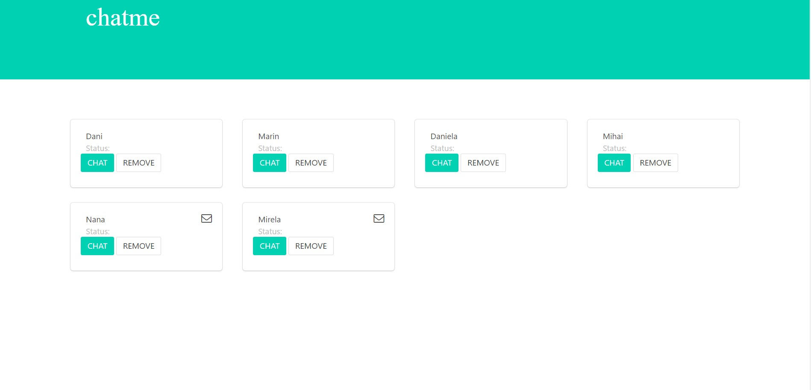
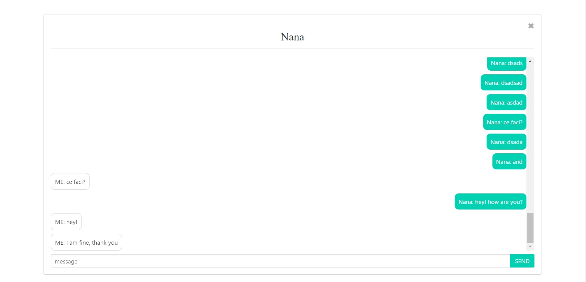
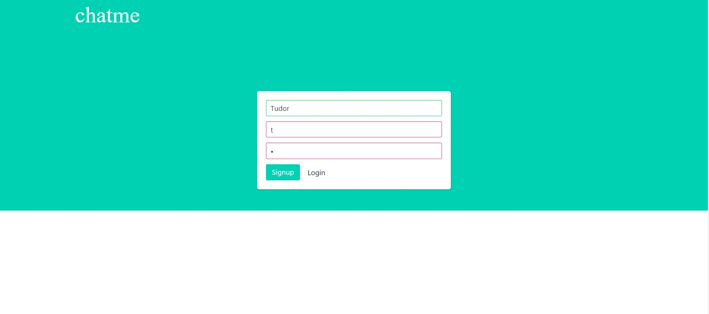
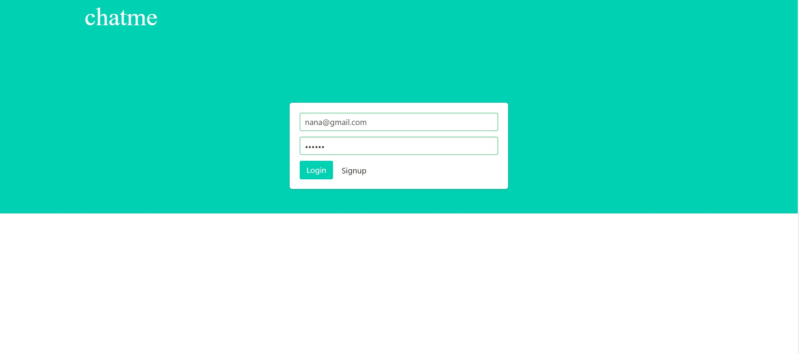

# MEAN Chat Application
A small chat application built using the MEAN stack

## Features

Register and authenticate users using JSON web tokens

Open 1on1 private conversations with a user of your choice

Notifications for messages on background conversations

Have a pleasant UI/UX built to look awesome from mobile to desktop

## Getting started
Prerequisites

if you don't know what you are doing go on the website and follow the instructions, those are pretty straight forward
NodeJS
MongoDB
Angular-CLI
# clone the repo
git clone https://github.com/tudordascalu/chat.git

# change into the repo directory
cd mean-chat-app

# !! edit config/database.js file !!
# with your own data

# install server dependencies
npm install

# change into the angular src directory
cd angular-src

# install frontend dependencies
npm install

# start the server
cd ../ && npm start

# in another terminal window
cd <App folder>/angular-src && npm start

Then visit http://localhost:4200 in your browser.

##Technologies
NodeJS - JavaScript backend/server-side solution of choice

Express - Node framework that makes handling http requests with ease

JsonWebToken - package that helps with generating JWTs for secure authentication

PassportJS - authentication middleware used to guard certain parts of the app for non-authenticated requests

MongoDB - data storage solution that just speaks JSON and pairs very well with Node

Mongoose - package that helps with object modeling and manages connection between server and database

Socket.io - web sockets implementation, fast and reliable real-time communication engine

Angular - rich frontend web framework, helps creating fast, reliable web applications

Angular-CLI - command line interface for streamlined angular development

TypeScript - superset of JavaScript that can be compiler-checked, also has types!!

MomentJS - JavaScript date/time parser

Bootstrap - CSS/JS framework, makes it easy to develop responsive, well polished web apps

##How it works
On the client-side users can create accounts that will be stored in the database. Then users can authenticate with the given credentials, if those are correct the server sends a unique token to the client. The client stores it for use on restricted backend route requests.

Once authenticated, the server creates a socket bidirectional connection with the client to facilitate the chat functionality.

Every time a user sends a message, this goes to the server which redirects it to the desired respondent. Also every time a user enters or leaves chat, the server announces all the connected clients.

##Motivation
This is a personal project with the purpose of better understanding the client-server communication paradigm, new web technologies.
